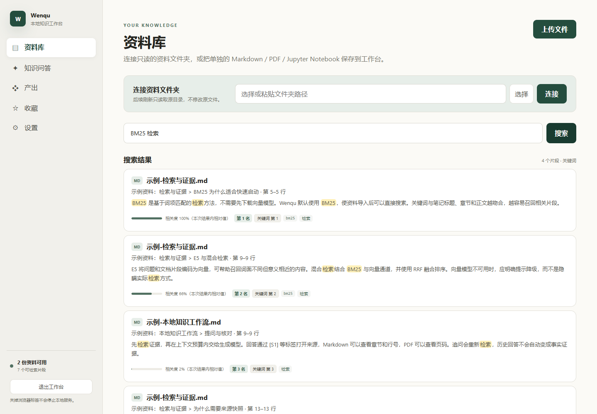
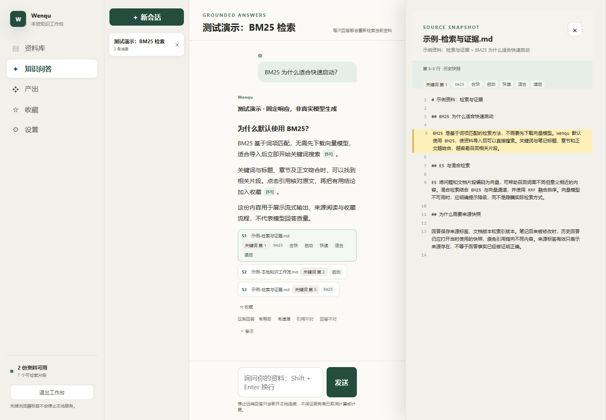
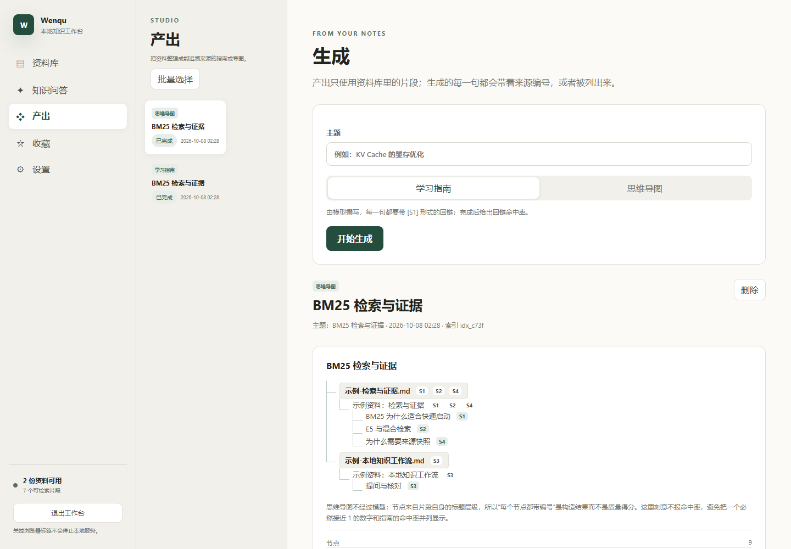
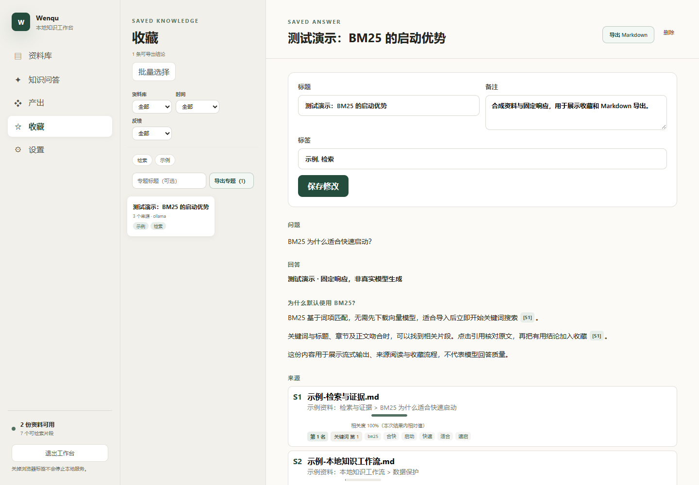
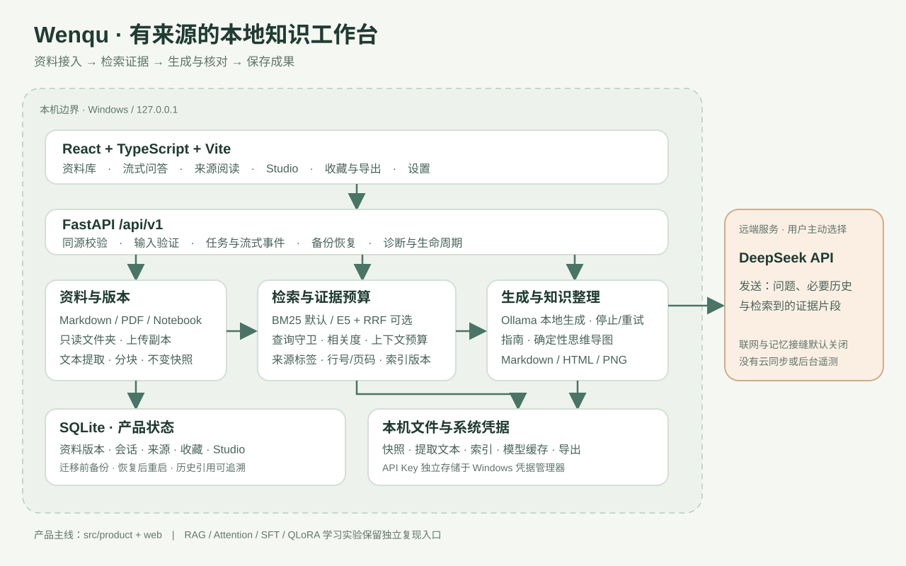

# Wenqu

**从资料到有来源的回答，再到可保存的知识成果。**

Wenqu（原 Obsidian RAG）是一个 Windows 本地个人知识工作台：接入 Markdown、文字型 PDF 和 Jupyter Notebook，使用 Ollama 或 DeepSeek 提问、核对来源，收藏并导出有用的结论。

[下载 0.2.3](https://github.com/nan-yizjm/obsidian-rag/releases/tag/v0.2.3) · [用户指南](docs/用户指南.md) · [开发与学习文档](docs/README.md) · [发布说明](docs/RELEASE_NOTES_0.2.3.md)

## 项目展示

以下界面使用仓库中的合成示例资料与独立数据目录，具体生成方式见 [展示说明](docs/assets/README.md)。

| 资料库与搜索 | 流式问答与来源核对 |
| --- | --- |
|  |  |
| **Studio：把资料整理成成果** | **收藏：保存与导出** |
|  |  |

## 下载与使用

支持 **Windows 10/11 x64**。从 [GitHub Release](https://github.com/nan-yizjm/obsidian-rag/releases/tag/v0.2.3) 下载 `Wenqu-Setup-0.2.3-win-x64.exe` 及同名 `.sha256`，使用 `Get-FileHash -Algorithm SHA256` 核对后安装。当前仓库为私有，下载需要仓库访问权限。

1. 打开 Wenqu，在设置页选择生成后端。
2. 连接只读 Markdown 文件夹，或上传 Markdown、文字型 PDF、`.ipynb`。
3. 等待导入完成，用默认 BM25 搜索；需要语义检索时再准备 E5 模型。
4. 提问并点击 `[S1]` 等标签，检查原文章节、行号或 PDF 页码。
5. 收藏答案、补充备注，或在 Studio 生成指南、思维导图，再导出 Markdown。

本地生成需要单独安装 Ollama，例如：

```powershell
ollama serve
ollama pull qwen2.5:7b
```

DeepSeek 在设置页填写 API Key。检索可在 CPU 运行，生成速度取决于本机模型与硬件。Windows 安装包包含 Python 运行时，使用者无需安装 Python 或 Node.js。

个人数据保存在 `%LOCALAPPDATA%\ObsidianRAG`，与安装目录分离；升级和卸载保留个人数据。API Key 存在 Windows 凭据管理器。连接文件夹不会修改原笔记；上传资料会保存本地副本。

## 架构与技术亮点



- **版本化证据**：资料更新生成新快照和索引，历史回答保留当时的来源与版本，避免引用静默漂移。
- **可解释检索**：默认 BM25，E5 与 RRF 混合检索可选；展示实际使用的检索方式与降级状态。
- **证据预算与流式生成**：按上下文容量保留完整证据，支持停止、重试、追问和会话恢复。
- **成果整理**：逐句来源指南、确定性思维导图、收藏及 UTF-8 Markdown 导出；本机浏览器用于 HTML/PNG 信息图渲染。
- **数据保护**：数据库迁移前备份、校验恢复、诊断脱敏、同源限制，以及 Windows 路径安全检查。

来源标签与回链覆盖率用于核对证据，不代表回答事实已经被自动证明正确。BM25/E5 的历史评测是特定私人语料上的实验，不能直接推广为通用质量结论。

## 开发、测试与构建

产品环境使用 **Python 3.12 x64 + CPU PyTorch、Node.js 24、npm**。以下命令从仓库根目录运行：

```powershell
py -3.12 -m venv .venv-product
.\.venv-product\Scripts\python.exe -m pip install torch==2.13.0 --index-url https://download.pytorch.org/whl/cpu
.\.venv-product\Scripts\python.exe -m pip install -r requirements-product.txt -r requirements-build.txt
npm --prefix web ci
npm --prefix web run build
.\.venv-product\Scripts\python.exe -X utf8 -m src.product_entry --no-browser
```

打开 `http://127.0.0.1:8765`。开发时可通过 `--port 8876 --data-root <独立目录>` 避开正式数据；前端热更新使用 `npm --prefix web run dev`。

```powershell
.\.venv-product\Scripts\python.exe -X utf8 -m unittest discover -s tests
npm --prefix web run test
npm --prefix web run build
powershell -NoProfile -ExecutionPolicy Bypass -File scripts/check_css_tokens.ps1
.\.venv-product\Scripts\python.exe -m pip check
.\.venv-product\Scripts\python.exe scripts/audit_dependencies.py
npm --prefix web audit --audit-level=high
```

[Windows CI](.github/workflows/checks.yml) 自动执行上述检查。本版本机验收的准确结果、安装与真实浏览器覆盖范围见 [收尾报告](docs/收尾报告-2026-10-08.md)。

Windows 构建需要 Inno Setup 6：

```powershell
powershell -NoProfile -ExecutionPolicy Bypass -File scripts/build_product.ps1
powershell -NoProfile -ExecutionPolicy Bypass -File scripts/test_installer.ps1
```

产物：`dist/Wenqu/` 便携目录、`dist-installer/Wenqu-Setup-0.2.3-win-x64.exe` 与 `.sha256`。安装验收编译测试专用 AppId，在临时目录中安装、覆盖升级并验证卸载保留；正式 AppId 保持旧版本兼容。发布步骤见 [发布检查清单](docs/发布检查清单.md)。

## 代码与学习复现

| 位置 | 内容 |
| --- | --- |
| `src/product/` + `src/product_entry.py` | 产品 API、数据库、资料、检索、聊天、Studio、备份与启动器 |
| `web/` | React + TypeScript 前端 |
| `tests/` + `scripts/` | 回归、界面验收、构建与依赖审计 |
| `src/` 顶层 | 原始 RAG、Attention、评测、SFT、QLoRA 等实验 |
| `data/` 顶层 | 已跟踪的评测题集；生成物与私人语料不提交 |
| `docs/学习记录/` | 阶段实现、故障与取舍记录 |
| `docs/archive/` | 历史规划与旧目录盘点，保留引用价值 |
| `examples/` | 随包欢迎资料与合成演示资料 |

- [学习记录索引](docs/学习记录/README.md)：从检索、Attention、训练到完整产品的演进。
- [检索评测复现指南](docs/检索评测复现指南.md)：复现方法与判据，原始私人语料不分发。
- [实验环境重建](docs/实验环境重建.md)：CPU 与 CUDA 环境分开，训练实验不覆盖产品环境。
- [容器实验](container/README.md)：旧 RAG 服务的容器基线，与 Windows 产品交付分别维护。
- [第三方许可证](docs/THIRD_PARTY_LICENSES.md)：随包依赖许可清单。

## 当前限制与隐私

PDF 仅提取文字，不含 OCR、复杂表格重建或图像理解，暂不支持 PPTX。联网和记忆是默认关闭的接口接缝，未配置真实后端时不会冒充已有能力。使用 DeepSeek 会把问题、必要对话与检索片段发送至远端。

项目是个人学习与小范围试用作品，没有账号、多用户、云同步、自动更新、后台遥测或自动修改 Obsidian 笔记。仓库未声明开源许可证；第三方许可证不替代项目本身的授权。

不要提交 `.env`、API Key、私人笔记、个人产品数据、训练生成物或虚拟环境。历史安装包仅供恢复，下载入口始终指向最新已验收版本。
